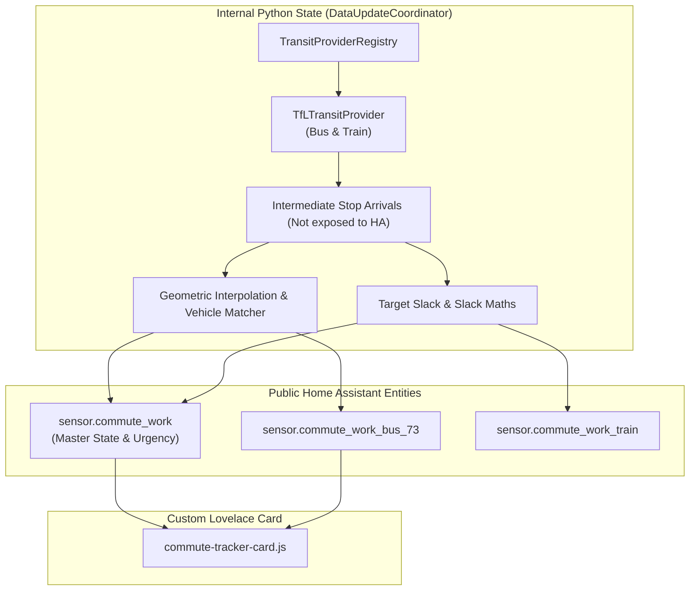

# Implementation Plan: Python Commute Tracker (`ha-commute-tracker`)

A standalone, spec-driven Home Assistant custom integration built with Red/Green Test-Driven Development (TDD) via Conductor, providing multi-modal transit tracking, corridor schematics, and urgency staging.

---

## User Review & Critical Feedback Addressed

> [!IMPORTANT]
> ### Critical Guard Rails & Architectural Additions
> 1. **Zero Impact on Live Home Assistant**: The existing working system (`packages/commute.yaml`, live helpers, automations, and dashboard cards) remains **100% untouched and active** during development.
> 2. **Guarded Release & 30-Second Rollback Protocol**:
>    * **Parallel Staging Run**: The Python integration will be staged in Home Assistant alongside the live YAML setup to verify real-time data parity on live transit feeds before cutover.
>    * **Atomic Backup**: An automated backup of the existing `packages/commute.yaml` and related helpers will be archived prior to switchover.
>    * **30-Second Rollback Guarantee**: If any discrepancy arises during live operation, re-enabling `packages/commute.yaml` and reloading core config restores the original system in under 30 seconds.
> 3. **Entity Minimalism & State-Driven Automations**: Intermediary raw API sensors are kept as **internal Python state**, eliminating entity clutter. The standalone timeliness sensor has also been condensed into attributes on the main sensors. Automations will trigger natively off state changes (or attribute changes) of the exposed sensors, removing the need for custom event buses.
> 4. **Universal Transit Provider Plugin Architecture (Any Mode)**: A decoupled, mode-agnostic `TransitProvider` interface covering buses, trains, trams, tube, and ferries.
> 5. **External Sensor-Driven Polling (Sleep/Wake)**: The integration will not invent complex internal cron logic for sleeping. It will observe an external Home Assistant binary sensor (e.g. `binary_sensor.commute_relevant`) to determine if it should actively poll or sleep, exactly like the current YAML implementation.
> 6. **Full OSS & HACS Compliance**: Managed with **`uv`**, fully equipped with MIT License, `README.md`, GitHub Actions CI/CD for tests, and HACS compatibility right out of the box.
> 7. **Lovelace Custom Card Inclusion**: The project will include a packaged custom Lovelace card (e.g., `commute-tracker-card`) designed specifically to consume this integration's condensed state payload.

---

## Universal Multi-Modal Transit Provider Plugin Architecture

To support any transit mode (bus, train, tram, ferry) and any transit data provider without refactoring the core commute engine, data ingestion is decoupled via a **Universal Provider Plugin Pattern**:

```mermaid
classDiagram
    class TransitMode {
        <<enumeration>>
        BUS
        TRAIN
        TUBE
        TRAM
        FERRY
    }

    class TransitProvider {
        <<interface>>
        +provider_id: str
        +supported_modes: set~TransitMode~
        +async_get_line_status(line_id: str, mode: TransitMode) LineStatus
        +async_get_telemetry(route: RouteConfig) RouteTelemetry
    }

    class TransitProviderRegistry {
        +_providers: dict[str, type[TransitProvider]]
        +register(provider_id: str)
        +get_provider(provider_id: str, **kwargs) TransitProvider
    }

    class TfLTransitProvider {
        +provider_id = "tfl"
        +supported_modes = {BUS, TRAIN, TUBE, TRAM}
    }

    TransitProvider <|.. TfLTransitProvider : Implements (Phase 3)
    TransitProviderRegistry o-- TransitProvider
    TransitProvider ..> TransitMode
```

### 1. Normalised Domain Models (Mode-Agnostic)
The core engine and Home Assistant entities interact **exclusively** with normalised models:
* `TransitMode`: Enum (`BUS`, `TRAIN`, `TUBE`, `TRAM`, `FERRY`).
* `LineStatus`: `status_label` ("Good Service", "Minor Delays"), `status_colour`, `status_icon`, `reason`.
* `DeparturePrediction`: `vehicle_id`, `destination`, `expected_time`, `seconds_to_arrival`, `platform_or_bay`, `is_realtime`.
* `RouteTelemetry`: departures list, active vehicle identifier, corridor progress ratio (`0.0` – `1.0`), current stop location label, line status.

### 2. Provider Implementations
* **`TfLTransitProvider` (Initial / Primary)**: Implements both `TransitMode.BUS` and `TransitMode.TRAIN` (via the TfL Unified API for buses and National Rail).


### 3. Declarative Route Configuration
The user maps providers and routes via YAML configuration. A rigorous `voluptuous` schema will validate this configuration on load.
```yaml
ha_commute_tracker:
  commutes:
    - name: "Work"
      active_sensor: binary_sensor.commute_relevant # Controls sleep/wake polling
      target_arrival: "08:40"
      routes:
        - mode: bus
          provider: tfl
          line: "73"
          direction: outbound
          target_stop: "STOP_ID"
```

---

## Public Entity Contract vs. Internal Python State



| Entity ID | Type | Purpose / Consumer |
| :--- | :--- | :--- |
| `sensor.commute_<id>` | Sensor | **Master State**: Main UI card consumer, urgency state (`standby`, `leave_now`). Includes `timeliness` attribute. Automations trigger off this state/attributes. |
| `sensor.commute_<id>_<route_id>` | Sensor | **Route Child Sensors**: Individual route metrics. Includes per-route `timeliness` attribute. |
| *(All Raw API Sensors)* | **Removed** | **Zero HA Entities**: Maintained entirely in Python memory. |
