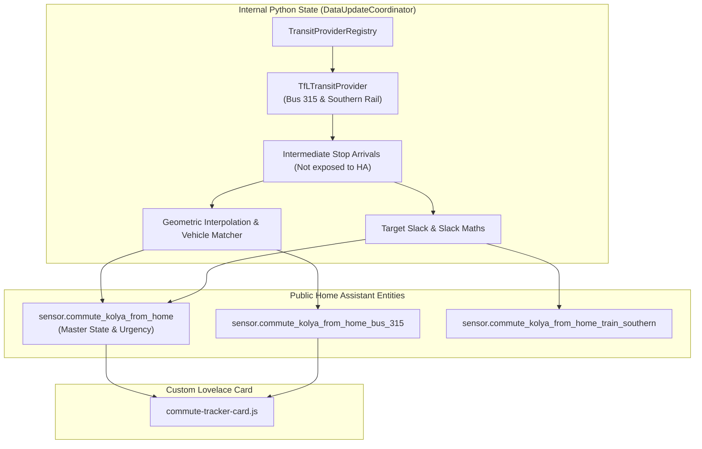

# Implementation Plan: Python Commute Tracker (`ha-commute-tracker`)

A standalone, spec-driven Home Assistant custom integration built with Red/Green Test-Driven Development (TDD) via Conductor, providing multi-modal transit tracking, corridor schematics, and urgency staging.

---

## User Review & Critical Feedback Addressed

> [!IMPORTANT]
> ### Critical Guard Rails & Architectural Additions
> 1. **Zero Impact on Live Home Assistant**: The existing working system (`packages/commute.yaml`, live helpers, automations, and dashboard cards) remains **100% untouched and active** during development.
> 2. **Guarded Release & 30-Second Rollback Protocol**:
>    * **Parallel Staging Run**: The Python integration will be staged in Home Assistant alongside the live YAML setup to verify real-time data parity on live transit feeds before cutover.
>    * **Atomic Backup**: An automated backup of the existing `packages/commute.yaml` and related helpers will be archived prior to switchover.
>    * **30-Second Rollback Guarantee**: If any discrepancy arises during live operation, re-enabling `packages/commute.yaml` and reloading core config restores the original system in under 30 seconds.
> 3. **Entity Minimalism & State-Driven Automations**: Intermediary raw API sensors are kept as **internal Python state**, eliminating entity clutter. The standalone timeliness sensor has also been condensed into attributes on the main sensors. Automations will trigger natively off state changes (or attribute changes) of the exposed sensors, removing the need for custom event buses.
> 4. **Universal Transit Provider Plugin Architecture (Any Mode)**: A decoupled, mode-agnostic `TransitProvider` interface covering buses, trains, trams, tube, and ferries. 
> 5. **External Sensor-Driven Polling (Sleep/Wake)**: The integration will not invent complex internal cron logic for sleeping. It will observe an external Home Assistant binary sensor (e.g. `binary_sensor.commute_relevant`) to determine if it should actively poll or sleep, exactly like the current YAML implementation.
> 6. **Full OSS & HACS Compliance**: Managed with **`uv`**, fully equipped with MIT License, `README.md`, GitHub Actions CI/CD for tests, and HACS compatibility right out of the box.
> 7. **Lovelace Custom Card Inclusion**: The project will include a packaged custom Lovelace card (e.g., `commute-tracker-card`) designed specifically to consume this integration's condensed state payload.

---

## Universal Multi-Modal Transit Provider Plugin Architecture

To support any transit mode (bus, train, tram, ferry) and any transit data provider without refactoring the core commute engine, data ingestion is decoupled via a **Universal Provider Plugin Pattern**:

```mermaid
classDiagram
    class TransitMode {
        <<enumeration>>
        BUS
        TRAIN
        TUBE
        TRAM
        FERRY
    }

    class TransitProvider {
        <<interface>>
        +provider_id: str
        +supported_modes: set~TransitMode~
        +async_get_line_status(line_id: str, mode: TransitMode) LineStatus
        +async_get_telemetry(route: RouteConfig) RouteTelemetry
    }

    class TransitProviderRegistry {
        +_providers: dict[str, type[TransitProvider]]
        +register(provider_id: str)
        +get_provider(provider_id: str, **kwargs) TransitProvider
    }

    class TfLTransitProvider {
        +provider_id = "tfl"
        +supported_modes = {BUS, TRAIN, TUBE, TRAM}
    }

    TransitProvider <|.. TfLTransitProvider : Implements (Phase 3)
    TransitProviderRegistry o-- TransitProvider
    TransitProvider ..> TransitMode
```

### 1. Normalised Domain Models (Mode-Agnostic)
The core engine and Home Assistant entities interact **exclusively** with normalised models:
* `TransitMode`: Enum (`BUS`, `TRAIN`, `TUBE`, `TRAM`, `FERRY`).
* `LineStatus`: `status_label` ("Good Service", "Minor Delays"), `status_color`, `status_icon`, `reason`.
* `DeparturePrediction`: `vehicle_id`, `destination`, `expected_time`, `seconds_to_arrival`, `platform_or_bay`, `is_realtime`.
* `RouteTelemetry`: departures list, active vehicle identifier, corridor progress ratio (`0.0` – `1.0`), current stop location label, line status.

### 2. Provider Implementations
* **`TfLTransitProvider` (Initial / Primary)**: Implements both `TransitMode.BUS` and `TransitMode.TRAIN` (via TfL National Rail proxy for Southern).

### 3. Declarative Route Configuration
The user maps providers and routes via YAML configuration. A rigorous `voluptuous` schema will validate this configuration on load.
```yaml
ha_commute_tracker:
  commutes:
    - name: "Kolya · To School"
      active_sensor: binary_sensor.commute_kolya_from_home_relevant # Controls sleep/wake polling
      target_arrival: "08:40"
      routes:
        - mode: bus
          provider: tfl
          line: "315"
          direction: outbound
          target_stop: "490019609S"
```

---

## Public Entity Contract vs. Internal Python State



| Entity ID | Type | Purpose / Consumer |
| :--- | :--- | :--- |
| `sensor.commute_<id>` | Sensor | **Master State**: Main UI card consumer, urgency state (`standby`, `leave_now`). Includes `timeliness` attribute. Automations trigger off this state/attributes. |
| `sensor.commute_<id>_<route_id>` | Sensor | **Route Child Sensors**: Individual route metrics. Includes per-route `timeliness` attribute. |
| *(All Raw API Sensors)* | **Removed** | **Zero HA Entities**: Maintained entirely in Python memory. |

---

## Agentic Development Guidelines (`.agents/rules/AGENTS.md`)

To ensure any agent working on this repository adheres to the established architectural decisions, the repository will enforce the following local AI rules:

1. **British English**: All documentation, logs, variable names, and code comments must use British English (e.g., `colour`, `behaviour`, `minimise`).
2. **Red/Green TDD Mandate**: The core logic (`engine.py`, `timeliness.py`, `providers/`) MUST be developed in pure Python first, writing unit tests against static JSON fixtures. Do not introduce Home Assistant dependencies or mocking until the raw data logic is proven to pass (Green).
3. **Strict Entity Minimalism**: The integration is forbidden from registering intermediary API state as Home Assistant entities. Only the Master Rollup and Child Route sensors may be registered. All raw transit arrivals must remain in the `DataUpdateCoordinator`'s internal memory.
4. **External Polling Triggers**: Agents must not implement internal `asyncio.sleep` loops or standalone cron jobs for the polling interval. Sleep/Wake behavior MUST be entirely driven by observing the state of the user-provided `active_sensor` from Home Assistant.
5. **HACS-First Structure**: All integration code must be placed strictly within the `custom_components/commute_tracker/` directory structure.
6. **No Device IDs**: Any generated Home Assistant automations or entity references must use HA Area names or `entity_id` strings, never hardcoded hardware `device_id`s.

---

## Phased Execution Roadmap

To mitigate risk and ensure high-quality delivery, execution is broken into strict micro-phases tracked via Conductor.

### Phase 1: HACS-First Repository Scaffolding, OSS & CI/CD
*   **Tasks:**
    *   Initialise Git repo (`ha-commute-tracker`). The directory structure will strictly follow HACS standards (`custom_components/commute_tracker/`) from day one.
    *   Create HACS compliance files (`hacs.json`, `info.md`) immediately so the integration can be installed as a "Custom Repository" in HACS even during local testing.
    *   Set up Python environment with `uv` and Home Assistant custom component testing dependencies.
    *   Add OSS hygiene: `LICENSE` (MIT), `README.md`, `CONTRIBUTING.md`, issue/PR templates.
    *   Configure GitHub Actions workflows (pytest, linting, HACS validation action).

### Phase 2: Spec Extraction & Data Fixtures
*   **Tasks:**
    *   Write `specs/commute_contract.md` defining exact sensor attributes.
    *   Capture real TfL JSON responses (bus stops, unified line arrivals, train status) and save to `tests/fixtures/`.

### Phase 3: Core Domain & Universal Provider (Isolated Python)
*   **Tasks:**
    *   *Goal: Prove we can parse the API without any HA overhead.*
    *   Implement `models.py` (`TransitMode`, `LineStatus`, `RouteTelemetry`).
    *   Implement `providers/base.py` and `TransitProviderRegistry`.
    *   Implement `providers/tfl.py` for Bus and Train.
    *   Write Red/Green unit tests against the Phase 2 fixtures.

### Phase 4: The Commute Engine (Math & Logic)
*   **Tasks:**
    *   *Goal: Prove the corridor progress and slack math works.*
    *   Implement `engine.py` (corridor interpolation, slack calculation, urgency state transitions).
    *   Implement `timeliness.py` (logic feeds attributes on master/child sensors rather than a standalone entity).
    *   Write unit tests verifying urgency shifts (`standby` -> `leave_now`) based on mocked predictions.

### Phase 5: Home Assistant Ingestion & Configuration
*   **Tasks:**
    *   *Goal: Mount the engine into Home Assistant memory.*
    *   Define `voluptuous` YAML schema validation (`const.py`, `config_validation`).
    *   Implement `DataUpdateCoordinator`.
    *   Implement Sleep/Wake logic: The coordinator monitors the user-configured `active_sensor` (e.g., `binary_sensor.commute_relevant`) to enable/disable polling.

### Phase 6: Public Entities & State Engine
*   **Tasks:**
    *   *Goal: Expose the data to the HA state machine.*
    *   Implement `sensor.py` exposing the Master Rollup and Child Routes.
    *   Ensure state changes perfectly mimic the legacy YAML behavior to allow native HA automations to trigger seamlessly.

### Phase 7: Lovelace Custom Card Development
*   **Tasks:**
    *   Scaffold a custom Lovelace card (e.g., `commute-tracker-card` using Lit/TypeScript or raw JS).
    *   Implement visual representation of the corridor schematics, route comparisons, and urgency states driven by the Master Rollup sensor attributes.
    *   Ensure HACS frontend packaging.

### Phase 8: Guarded Staging & HACS Cutover
*   **Tasks:**
    *   Deploy integration to live HA natively via **HACS Custom Repository** installation (validating the HACS deployment flow).
    *   Compare live YAML attributes vs Python attributes side-by-side.
    *   Update automations to trigger off new sensor states (removing custom events).
    *   Atomic cutover and fallback verification.

---

## Verification Plan

### Automated Unit & Contract Tests
* `uv run pytest tests/test_providers.py`: Provider interface conformance.
* `uv run pytest tests/test_tfl_provider.py`: TfL provider fixture parsing.
* `uv run pytest tests/test_engine.py`: Corridor progress interpolation and slack calculations.
* `uv run pytest tests/test_ha_coordinator.py`: Verifies sleep/wake polling logic responds correctly to HA sensor state mocks.

### Guarded Manual Staging Tests
* Compare live YAML attributes against Python integration attributes side-by-side.
* Verify custom Lovelace card renders identically to the legacy implementation.
