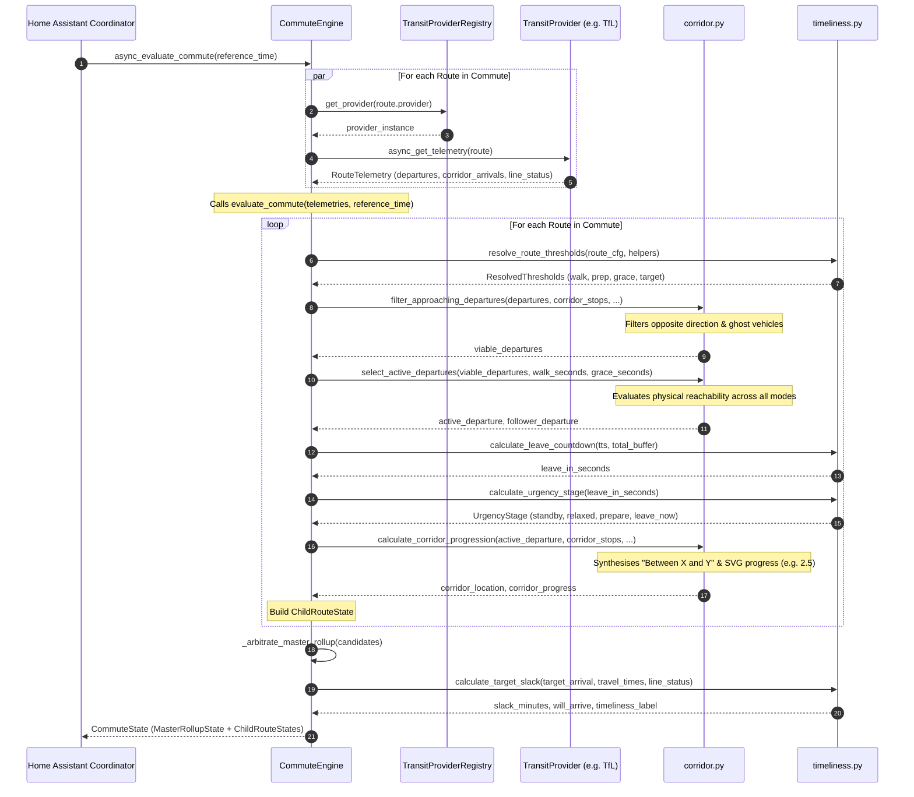

# Control Flow & Decision Engine

This document provides a detailed technical trace of how transit telemetry moves through `ha-commute-tracker`. It details what components call what, how responsibilities are delegated, and the mathematical rules governing vehicle direction, reachability, corridor progression, and arbitration.

---

## 1. End-to-End Control Flow Diagram



---

## 2. Understanding `CommuteEngine.async_evaluate_commute`

### Context and Purpose
[`CommuteEngine.async_evaluate_commute`](../custom_components/commute_tracker/engine.py) is the asynchronous entry point coordinating the integration:
1. Queries the registered transit provider for each route in parallel via `asyncio.gather`.
2. Isolates provider network errors so failure on one route does not compromise the arbitration of other alternatives.
3. Hands assembled [`RouteTelemetry`](../custom_components/commute_tracker/models.py) objects into `evaluate_commute(...)` for deterministic calculation.

### Pure Decision Engine (`evaluate_commute`)
[`CommuteEngine.evaluate_commute`](../custom_components/commute_tracker/engine.py) performs all synchronous domain math:
- **Input**: A dictionary of pre-fetched [`RouteTelemetry`](../custom_components/commute_tracker/models.py) instances mapped by `route_id`, an optional `reference_time`, and optional helper overrides.
- **Output**: A comprehensive [`CommuteState`](../custom_components/commute_tracker/models.py) containing the arbitrated master state and individual child states.

This separation guarantees that whether telemetries originate from live async provider calls or offline mock fixtures in unit tests, the exact same pure arbitration logic executes.

---

## 3. Algorithmic Responsibilities & Rules

### A. Threshold Cascading Resolution ([`timeliness.py`](../custom_components/commute_tracker/timeliness.py))
Before evaluating arrival predictions, the engine determines walking, preparation, and grace buffers for each route via `resolve_route_thresholds`:
1. **Tier 1 (Highest)**: Home Assistant Input Helper runtime overrides (e.g. `walk_minutes` or `walk_seconds` from an entity helper).
2. **Tier 2**: Route-specific YAML configuration values (`walk_seconds` or `walk_minutes`).
3. **Tier 3 (Lowest)**: Global defaults (`DEFAULT_WALK_SECONDS = 240`, `DEFAULT_PREP_SECONDS = 120`, `DEFAULT_GRACE_SECONDS = 180`).

### B. Direction & Trajectory Filtering ([`corridor.filter_approaching_departures`](../custom_components/commute_tracker/corridor.py))
*Responsibility: Discard vehicles travelling in reverse or vehicles too far away to confirm corridor presence.*

A common failure in public transit APIs is receiving departures at a boarding stop for vehicles travelling in the opposite direction, or "ghost" predictions that disappear.
1. The route configuration provides an ordered list of corridor stops leading to the boarding stop:
   `["Stop 1", "Stop 2", "Stop 3 (Boarding)"]`
2. An index is constructed mapping `(stop_id, vehicle_id) -> seconds_to_arrival`.
3. **Opposing Trajectory Filter**: If a vehicle's arrival at an upstream corridor stop (e.g. Stop 1) is *greater* than its arrival at the boarding stop (Stop 3), the vehicle is travelling away from the boarding stop into the corridor (or in reverse). It is immediately discarded.
4. **Ghost Vehicle Filter**: If a vehicle has no recorded arrivals at any upstream corridor stop and is more than 10 minutes (`CORRIDOR_UPSTREAM_HORIZON_SECONDS = 600`) away from the boarding stop, it is discarded until it enters the observable corridor.

### C. Active Departure Selection & Reachability ([`corridor.select_active_departures`](../custom_components/commute_tracker/corridor.py))
*Responsibility: Decide which departure is the active focus and identify its queue follower.*

Selection operates uniformly across all transit modes without mode-specific carve-outs:
1. **Physical Reachability ([`timeliness.is_departure_reachable`](../custom_components/commute_tracker/timeliness.py))**:
   - `seconds_to_arrival >= walk_seconds - grace_seconds`
   - A commuter leaving immediately requires `walk_seconds` to walk to the stop.
   - `grace_seconds` provides a leeway buffer allowing the commuter to sprint or catch the service while boarding doors are open.
   - If `seconds_to_arrival < walk_seconds - grace_seconds`, the vehicle is mathematically unreachable.
2. **Sequential Selection**:
   - The engine iterates through the candidate departures sorted by arrival time and selects the first departure satisfying `is_departure_reachable`.
   - The subsequent departure in the sorted list (if available) is assigned as `follower_departure` to power the "Next Bus" or "Subsequent Departure" preview.
   - If no departures are reachable, `(None, None)` is returned and the route enters `STANDBY`.

### D. Natural Language Location & Corridor Progression ([`corridor.calculate_corridor_progression`](../custom_components/commute_tracker/corridor.py))
*Responsibility: Generate glanceable position descriptions and SVG animation coordinates.*

1. **Natural Language Location**:
   - If `active_dep.seconds_to_arrival <= 45s`: Returns `"At <Stop Name>"`.
   - If the vehicle is between two stops in the corridor: Returns `"Between <Previous Stop> and <Next Stop>"`.
2. **Fractional Progress Index**:
   - For an ordered corridor of stops with indices `0, 1, 2, ..., N`:
     - When dwelling at stop `i`: Progress is `float(i)`.
     - When traversing between stop `i-1` and `i`: Progress is `float(i) - 0.5`.
   - This floating-point value is directly consumed by the Lovelace card to position the transit vehicle icon along SVG route tracks.

### E. Urgency Lifecycle Transitions ([`timeliness.calculate_urgency_stage`](../custom_components/commute_tracker/timeliness.py))
*Responsibility: Categorise the commute status into glanceable visual urgency states.*

```text
Countdown (leave_in_seconds):
     > 480s               0s < leave_in <= 480s               <= 0s
 ─────────────┬─────────────────────────────────────────┬───────────────►
   RELAXED    │                 PREPARE                 │   LEAVE NOW
  (Green UI)  │               (Amber UI)                │    (Red UI)
```

- **`STANDBY`**: No active departures (`leave_in_seconds is None`).
- **`RELAXED`**: Transit option is reachable and departure time is distant (`leave_in_seconds > 480`).
- **`PREPARE`**: Countdown enters the preparation threshold (`0 < leave_in_seconds <= 480`).
- **`LEAVE_NOW`**: Doorstep deadline reached or passed (`leave_in_seconds <= 0`).

### F. Destination Slack Maths & Timeliness ([`timeliness.calculate_target_slack`](../custom_components/commute_tracker/timeliness.py))
*Responsibility: Calculate expected destination arrival and timeliness status.*

1. **Total Estimated Journey**:
   `total_journey = boarding_arrival_seconds + in_vehicle_duration + alighting_walk`
2. **Estimated Destination Arrival Time**:
   `est_arrival_dt = reference_time + timedelta(seconds=total_journey)`
3. **Midnight Rollover Correction**:
   If the target arrival time wraps past midnight relative to observation time, the engine shifts `target_dt` by `±1 day` when the gap exceeds `MIDNIGHT_WRAP_THRESHOLD_SECONDS` (12 hours).
4. **Slack Minutes**:
   `slack_minutes = round((target_dt - est_arrival_dt) / 60)`
   - Positive slack indicates arriving ahead of deadline.
   - Negative slack indicates arriving late.
5. **Timeliness Classifications**:
   - `cancelled`: Line or route is cancelled.
   - `late`: `slack_minutes < 0`.
   - `delayed`: Operational service delay reported on line status.
   - `early`: `slack_minutes >= 5`.
   - `on_time`: Arriving within 0–4 minutes of target deadline.

### G. Master Rollup Arbitration ([`engine._arbitrate_master_rollup`](../custom_components/commute_tracker/engine.py))
*Responsibility: Arbitrate the winning active option across multi-modal alternatives (e.g. Bus vs Train).*

1. Filters all candidate routes in active urgency stages (`leave_now`, `prepare`, `relaxed`).
2. If any route is in `leave_now`:
   - Selects the route with the highest `leave_in_seconds` (the option providing the cleanest doorstep window).
3. If no routes are in `leave_now`:
   - Selects the route with the smallest `leave_in_seconds` (the soonest viable transit option).
4. Populates [`MasterRollupState`](../custom_components/commute_tracker/engine.py) with the winning option's identity, formatted arrival time, urgency stage, and destination slack metrics.
