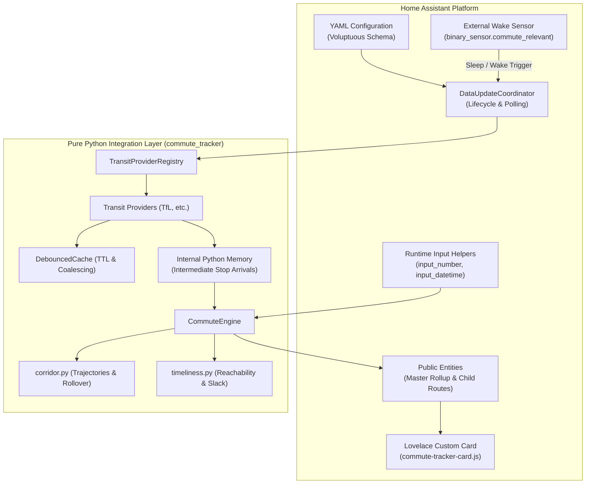

# System Architecture & Component Boundaries

This document defines how `ha-commute-tracker` is organised, where the boundaries between Home Assistant and the Python integration lie, and how the core design principles govern system behaviour.

---

## 1. Division of Responsibilities

A key architectural objective of this integration is maintaining clean boundaries between the Home Assistant platform and pure Python domain logic.



### What Home Assistant is Responsible For
1. **Configuration & Schemas**: Parses `configuration.yaml` via strict Voluptuous schemas, validating routes, lines, stops, walking thresholds, and provider credentials.
2. **Runtime Threshold Overrides**: Exposes integration parameters to user-configurable Home Assistant Input Helpers (`input_number.walk_minutes`, `input_datetime.target_arrival`).
3. **Sleep/Wake Governance**: Evaluates user automations or schedule helpers (e.g. `binary_sensor.commute_relevant`) to instruct the coordinator when to poll and when to idle.
4. **State Machine Exposure**: Registers and updates public state entities (`sensor.commute_*`), triggering native Home Assistant automations based on urgency state transitions.
5. **Static Asset Hosting**: Registers and serves the bundled custom Lovelace card (`commute-tracker-card.js`) directly through Home Assistant's HTTP server (`add_extra_html_url`).

### What the Python Domain Layer is Responsible For
1. **Asynchronous I/O & Caching**: Efficiently fetches remote transit payloads with in-flight request coalescing and TTL caching via [`DebouncedCache`](../custom_components/commute_tracker/providers/base.py).
2. **Normalisation**: Ingests vendor-specific payloads (e.g. TfL Unified API, National Rail) and converts them into uniform, mode-agnostic domain models.
3. **Internal State Management**: Holds raw transit arrivals and multi-stop corridor predictions in memory without cluttering Home Assistant's state engine or recorder database.
4. **Pure Mathematical Evaluation**: Executes all doorstep departure deadlines, trajectory direction filtering, physical reachability checks, fractional corridor interpolation, and destination slack maths without external platform dependencies.
5. **Master Option Arbitration**: Determines which route (e.g. Bus vs Train vs Tube) is currently optimal and dictates the master urgency level.

---

## 2. The Strict Entity Minimalism Mandate

A common anti-pattern in transit tracking integrations is registering every intermediate transit stop or raw API metric as a separate Home Assistant entity. For a corridor with 12 stops across 3 alternative routes, this could spawn over 50 entities, causing:
- Database bloat in Home Assistant's SQLite/PostgreSQL recorder.
- Excessive event bus traffic on state changes.
- Complex, brittle Jinja2 templating on the user's dashboard.

### The Two-Tier Entity Model
`ha-commute-tracker` strictly enforces a two-tier entity contract:

| Entity ID | Entity Role | State | Key Attributes |
| :--- | :--- | :--- | :--- |
| `sensor.commute_<commute_id>` | **Master Rollup** | Urgency stage (`standby`, `relaxed`, `prepare`, `leave_now`) | `active_option`, `expected_time`, `seconds_to_arrival`, `leave_in_seconds`, `route_label`, `will_arrive_in_time`, `target_slack_minutes` |
| `sensor.commute_<commute_id>_<route_id>` | **Child Route** | Primary arrival display time or departure status | `route_id`, `mode`, `urgency_stage`, `vehicle_id`, `seconds_to_arrival`, `leave_in_seconds`, `corridor_location`, `corridor_progress`, `next_vehicle_id`, `line_status` |

All intermediate stop arrivals, raw arrival arrays, and trajectory calculation steps are kept exclusively in Python memory inside the coordinator.

---

## 3. Sleep/Wake Lifecycle (External Polling Control)

Transit APIs enforce rate limits. Running background HTTP requests when the user is sleeping or away from home is wasteful and risks API throttling.

Rather than implementing complex internal scheduling logic or cron loops, `ha-commute-tracker` delegates wakefulness entirely to Home Assistant:

```text
[Home Assistant State Engine]
              │
    binary_sensor.commute_relevant  ──►  ON
              │
              ▼
[DataUpdateCoordinator]
  - Activates polling timer (e.g. 30s)
  - Fetches provider telemetry
  - Runs CommuteEngine evaluation
  - Updates Master & Child entities (relaxed -> prepare -> leave_now)
              │
    binary_sensor.commute_relevant  ──►  OFF
              │
              ▼
[DataUpdateCoordinator]
  - Halts polling timer immediately
  - Cancels pending requests
  - Transitions all sensors to 'standby'
```

- When the monitored `active_sensor` is `off`, the coordinator stops polling completely.
- When `active_sensor` turns `on`, the coordinator polls immediately and resumes regular intervals until turned `off`.
